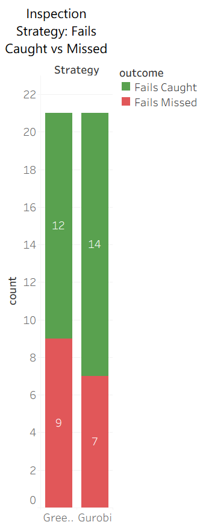
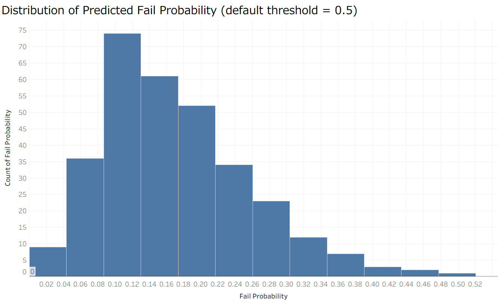

# secom-yield-optimization

Predicting manufacturing defects and optimizing inspection decisions 
under limited resources, using the SECOM semiconductor dataset.

## Background

In many manufacturing settings, sensors record far more data than 
is actually useful, and inspecting every single unit isn't practical 
due to time or cost. This project asks two questions: (1) can we 
predict which units are likely to be defective from sensor data, and 
(2) given a limited inspection budget, which units should actually 
be inspected?

Most public projects using this dataset stop at the prediction step. 
This one goes further — using the predicted risk as input to an 
inspection allocation problem, solved as an optimization model 
with Gurobi.

**Dataset**: [SECOM Dataset](https://archive.ics.uci.edu/dataset/179/secom) 
(UCI Machine Learning Repository, 2008) — 1,567 units, 590 anonymized 
sensor features, pass/fail label (1,463 pass / 104 fail), from a 
semiconductor fabrication line.

## Methodology

1. **Data cleaning** — Removed sensors with excessive missing values 
   (>60%), imputed the rest, and flagged which sensors had missing 
   readings (as those patterns can carry signal too).

2. **Prediction** — Trained a classifier to estimate each unit's 
   fail probability. Since fails are rare (~7% of units), standard 
   training missed all of them; adjusting the decision threshold 
   improved fail detection substantially, at the cost of more false 
   alarms.

3. **Optimization** — Framed inspection allocation as a 0/1 knapsack 
   problem: given a limited inspection budget and a cost per unit, 
   which units should be inspected to minimize the expected cost of 
   missed defects? Solved with Gurobi and compared against a greedy 
   (sort-by-risk) baseline.

## Key Results

- With the default classification threshold, the model missed every 
  real fail (0% recall) — a common failure mode when the positive 
  class is rare (~7% here). Adjusting the decision threshold improved 
  fail detection to **57%** recall.

- Under the same inspection budget, the Gurobi-optimized allocation 
  caught **14 of 21** real defects in the test set, compared to 
  **12 of 21** with a simple greedy (highest-risk-first) approach — 
  a measurable improvement at no extra cost.

## Visualizations



Gurobi's optimized allocation caught more real defects than a 
greedy baseline, under the same inspection budget.



Most predicted fail probabilities stay well below the default 0.5 
threshold, which is why threshold tuning mattered more than changing 
how the model was trained.

## Limitations & Future Work

- Inspection cost is simulated (random values), not based on real 
  cost data — the dataset doesn't include this information.
- Standard imbalance-handling techniques (class weighting, SMOTE) 
  didn't improve fail detection on their own; threshold tuning did. 
  This may be specific to this dataset's high dimensionality and 
  small number of fail cases.
- Next step: derive the inspection threshold directly from cost 
  assumptions (cost of a missed fail vs. cost of inspection), rather 
  than choosing it manually.

## Tech Stack

Python (pandas, scikit-learn, imbalanced-learn), Gurobi, Tableau

## Project Structure

```
├── notebooks/
│   ├── 01_eda.ipynb          # Data cleaning and exploration
│   ├── 02_modeling.ipynb     # Prediction and imbalance handling
│   └── 03_optimization.ipynb # Gurobi knapsack optimization
├── images/                   # Tableau exports
└── requirements.txt
```
